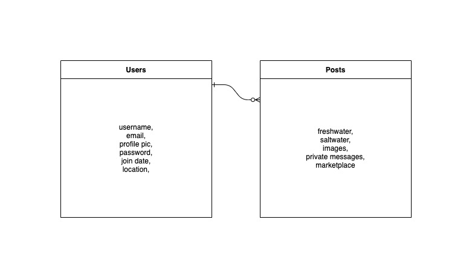

# Aquarist-Forum

Project Scope:

This project’s main purpose is to be a place for fish keeping enthusiasts to get and share information about the hobby. Users will be able to create an account in which they can store and update a variety of personal information about their own tanks and fish. They will also be able to post questions about the hobby, and answers to other user’s questions.

Also included in the site will be an online marketplace where users can buy and sell livestock and aquarium equipment.

Some stretch goals for this site will be to include some fun features like a gallon calculator where users can post the dimensions of their tank and find out how many gallons of water the tank contains. Also, a compatibility function where users can input multiple species of livestock and see if they are compatible with each other.

User Story:

The user will begin on the home page where they will have the option to either browse the contents of the site without logging in, or create a user profile. If they choose to create a user profile they will then be able to contribute posts to the site and private message one another.

When a user does create a profile they will be directed to their individual profile page in which they can edit the details of their profile and browse their past contributions to the site. They will also be able to access their private messages.

There will be several posting topics in which the user can navigate through to either contribute or just learn from other user's posts. These topics will include freshwater, saltwater, tank pics, and the marketplace.

Milestones:

10/31/20 - Working site navigation and database manipulation (MVP) in Django

11/3/20 - Complete Site Bootstrap Styling

11/5/20 - Extra features (tank volume calculator, fish compatibility feature) stretch goals